# Plasma Speakers

Multichannel sound art using audio-modulated plasma loudspeakers.
Guest research residency, ZKM | Center for Art and Media Karlsruhe, 2017.

This project was also part of a teaching series at [HfG Karlsruhe](https://www.hfg-karlsruhe.de) in 2024 ([Sound: Art and Technology](https://medienkunst-sound.de/courses/sound-art-and-technology)), introducing basic electronics and acoustics for sound art applications. Setting up this documentation repository was part of that course.

> **Note:** This documentation was compiled retrospectively, some time after the project was completed. It is incomplete; some working materials and notes are no longer available.

---

## Overview

A plasma loudspeaker produces sound without any moving electromechanical parts: an amplitude-modulated high-voltage arc drives changes in air pressure directly with a fluctuating electrical discharge. The arc is a massless, omni-directional point source with a flat frequency response at higher frequencies and a perfect transient response, resulting in exceptionally clear and precise sound. Its point source characteristics allow precise localisation in spatial audio environments.

This installation scales the phenomenon to 16 independent plasma loudspeakers, staged on custom-built glass-aluminium-steel tables with laboratory stands and arranged as a constellation in the centre of the room. Audiences can move freely around and through the installation. Speakers may play together forming a single 3D sound sculpture, or operate independently as uncorrelated individual point sources.

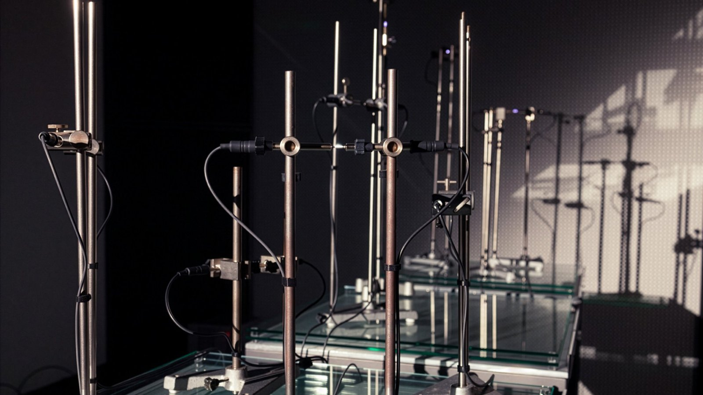
*Installation view, klingt gut! Symposium, Hamburg, 2017. © Gertje König, 2017.*
 

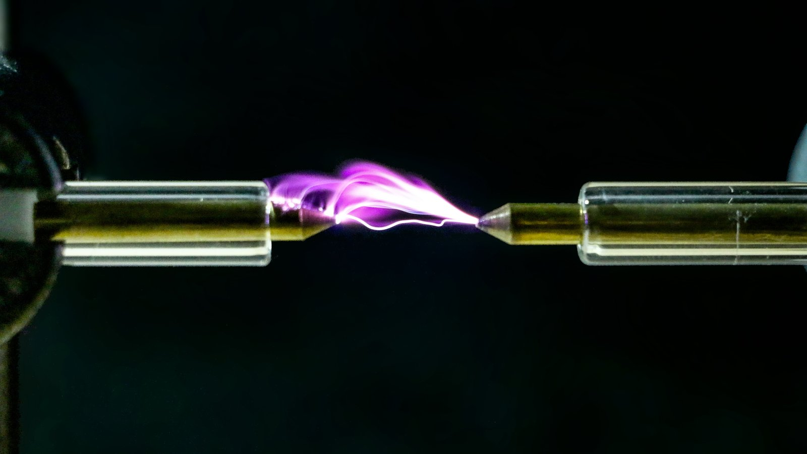
*Plasma arc detail. © Lorenz Schwarz, 2017.*
 

---

## Background and History

Around 1900, [William Duddell](https://en.wikipedia.org/wiki/William_Duddell) demonstrated that a carbon arc lamp driven by an LC oscillator could produce tones, a phenomenon that became known as the "singing arc". The first practical high-fidelity plasma tweeter followed in the late 1940s, when French physicist Siegfried Klein developed the ionophone, which led to commercial products including the DuKane Ionovac (USA, 1957), the Magnat MP (1980s), and the Hill Plasmatronics Type 1 (USA, 1978). In commercial applications, the plasma tweeter is invariably part of a multi-way system, typically three-way, covering only the high-frequency range, with conventional drivers handling mid and bass frequencies.

Despite their acoustic properties, plasma speakers have remained a narrow specialist product. High-voltage RF circuits, ozone production, and RF interference make them difficult to handle, and modern electrodynamic drivers can be produced in audiophile quality.

For artistic purposes, the plasma retains qualities beyond its acoustic performance. Sound and light emerge from the same discharge simultaneously, physical and visible, while producing sound without any mechanical movement. This contradiction is what makes the technology interesting beyond its technical properties.

---

## Different Approaches

Two types of electrical discharge have been examined for electroacoustic
coupling: corona discharge and spark discharge. Three different driver
circuits were built and evaluated.

### Corona Discharge

Corona discharge occurs when the electric field is strong enough to ionise
the surrounding air without causing a full spark. Two corona-based approaches
were tested:

**Tesla Coil Driver:** A switching amplifier driving a tesla coil produces a stable corona with considerable volume. However, the resonance frequency is critical for proper operation; if not matched precisely, the corona collapses and requires manual re-ignition. In practice, the circuit proved noisy and the sound quality was not satisfactory. Good audio quality can be achieved with this approach, however the circuit is complex with a high part count, which adds up significantly when scaling to multiple channels.

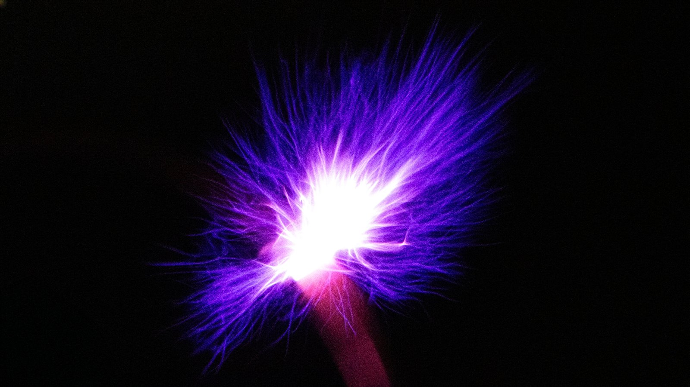
*Corona discharge, Tesla coil driver. © Lorenz Schwarz, 2017.*
 

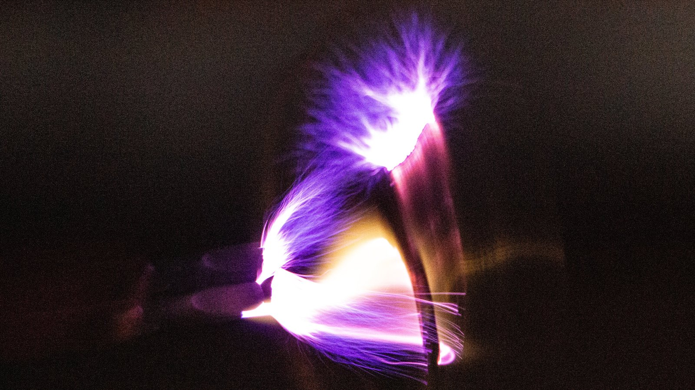
*Corona discharge, Tesla coil driver. © Lorenz Schwarz, 2017.*
 

**Vacuum Tube Circuit:** A self-oscillating RF circuit built around a vacuum tube, with audio coupled into the RF stage via a dedicated modulation board, was built and tested as a direct implementation of the classical plasma speaker design used in commercial audiophile products. In this circuit, the tube generates a high-frequency carrier oscillation; the modulation produces amplitude modulation of the carrier that drives the corona discharge. The circuit was assembled and operated successfully as a proof-of-concept.
Sound quality was good, consistent with the known properties of the design. However, several factors ruled it out for the multi-channel installation context. Output volume was low, limiting its suitability for a room-scale work. The circuit requires high-voltage DC supplies at 600 V at the anode, making it substantially more hazardous to work with than solid-state alternatives, and the entire HF section requires housing in a Faraday cage to prevent RF interference with surrounding equipment. Component cost is considerably higher. Scaling to 16 independent drivers would have introduced significant complexity. The approach was set aside in favour of the flyback coil design (see below).

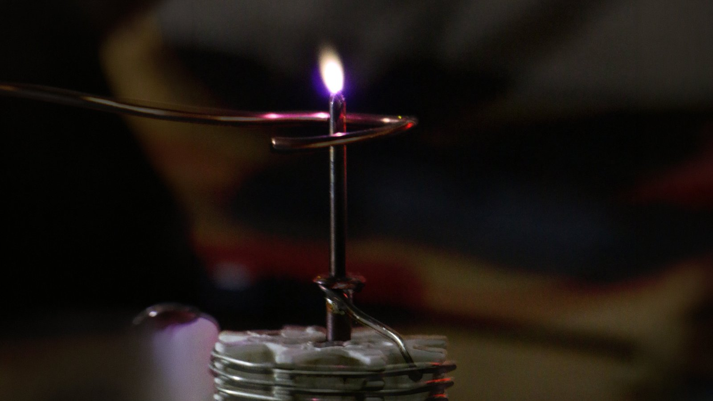
*Corona discharge, vacuum tube circuit. © Lorenz Schwarz, 2017.*
 

### Spark Discharge: Flyback Coil Driver *(selected approach)*

A flyback transformer (originally developed for Cathode Ray Tubes) produces a high-voltage pulse in the secondary when the transistor switches off, reaching tens of thousands of volts and sustaining an arc between closely spaced electrodes. These transformers are widely available as salvage from older CRT monitors and televisions. The circuit consists of a simple audio preamp, a square wave oscillator for PWM modulation, and a MOSFET driving the transformer.
**Primary coil**

Most builders replace the original primary winding with a custom coil of 5–15 turns wound directly onto the exposed ferrite core, to set a suitable primary inductance. The diode-split secondary coil integrates a high-voltage rectifier diode, making the transformer self-contained for DC arc applications. During this project, one transformer type was found that worked reliably with its original windings intact, avoiding the need for rewinding.

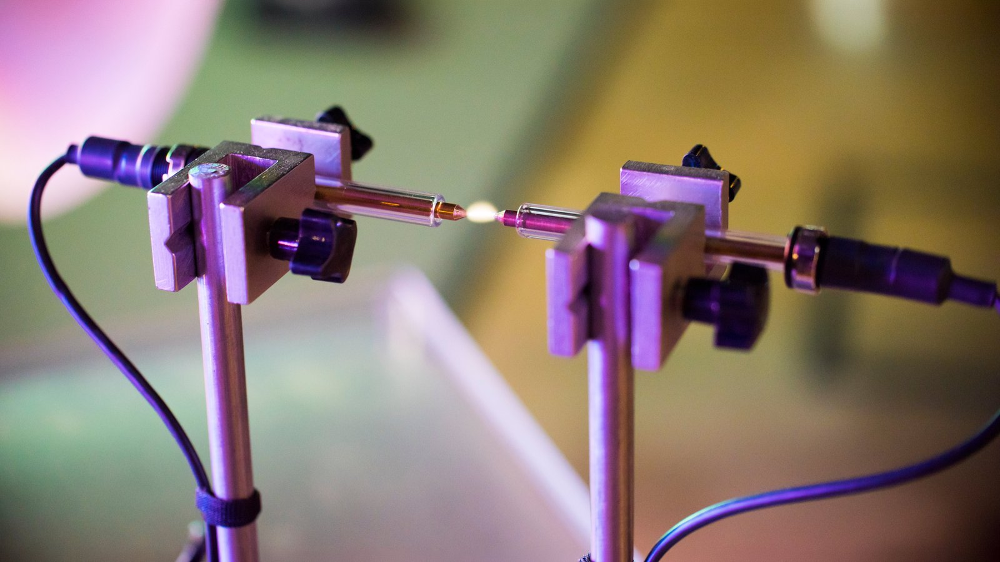
*Close-up of spark arc, laboratory retort clamps visible. © Jayoung Bang, 2017.*
 

---

## Technical Challenges

### Carrier Frequency and Coil Resonance

The flyback transformer has a natural resonant frequency determined by its winding inductance and internal capacitance. Driving at or near this frequency maximises energy transfer and arc brightness. Operating off-resonance increases heat in both transformer and switching transistor. The resonant frequency can be found empirically by adjusting the oscillator frequency while observing arc brightness.

This resonant frequency presents a constraint for audio use. The switching frequency of the MOSFET (the carrier) must stay above the audible range, otherwise one would introduce a constant high-pitched tone, independent of the audio signal. TV flybacks typically resonate around 15 kHz, while monitor flybacks resonate between 30 and 150 kHz and satisfy the earlier mentioned requirement.

**PWM Modulation**

Audio reproduction works as follows: the MOSFET switches the primary coil at the carrier frequency. The duty cycle of this switching is then modulated by the audio signal: a wider pulse means more energy per cycle, a narrower pulse means less. The arc intensity follows the duty cycle variation, producing proportional changes in air pressure, which are heard as sound, while the carrier frequency itself is inaudible.

Common ICs for generating the carrier and modulating the duty cycle are the 555 timer chip, the SG3525, and the TL494.

Power MOSFETs from the IRFP series are well suited to this application. The simplest topology uses a single MOSFET switching the primary to ground. A half-bridge configuration uses two complementary MOSFETs, doubling the effective voltage swing.

<picture>
  <source media="(prefers-color-scheme: dark)"  srcset="assets/img/pwm_diagram-dark.svg">
  <source media="(prefers-color-scheme: light)" srcset="assets/img/pwm_diagram-light.svg">
  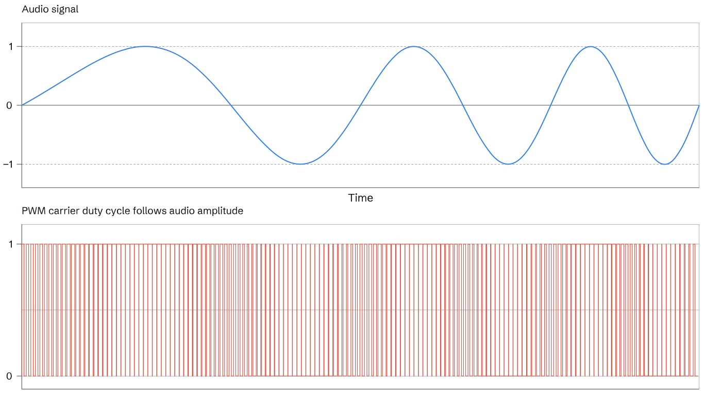
</picture>

---

### Electromagnetic Interference

The high-voltage circuits introduced significant electromagnetic interference
and antenna effects, resulting in noise in the audio signal chain and also affecting electronic devices nearby. This was resolved through careful grounding, shielding, and balanced signalling. Galvanic isolation between each driver and the audio interface was achieved using line transformers.

### Back EMF and Snubber Circuits

When the MOSFET switches off, the collapsing magnetic field in the flyback
transformer induces a large voltage spike across the switching transistor.
Without protection, these spikes can damage the MOSFETs over time.

A snubber circuit was therefore integrated across the MOSFET to clamp these transients. The snubber consists of a resistor-capacitor network, or alternatively a transient-voltage-suppression diode placed in parallel, to absorb the inductive energy.

### Thermal Management

The flyback transformer, wirewound resistor, suppressor diode, the electrode tips, and MOSFET are the primary heat sources in the driver circuit. Under continuous operation, the transformer core and windings can reach temperatures that risk enamel failure if thermal management is insufficient. Heat sinks were fitted to the MOSFET and, where applicable, to other dissipating components. Heat-resistant materials, including PTFE for electrode insulation and borosilicate glass for the electrode sleeve, were selected throughout. However, overheating the transformer over extended operation occurred relatively often.

The brass electrode tips eroded slowly over time due to the arc. In practice, electrodes had to be cleaned, and in some cases ground down or replaced, after longer periods of use.

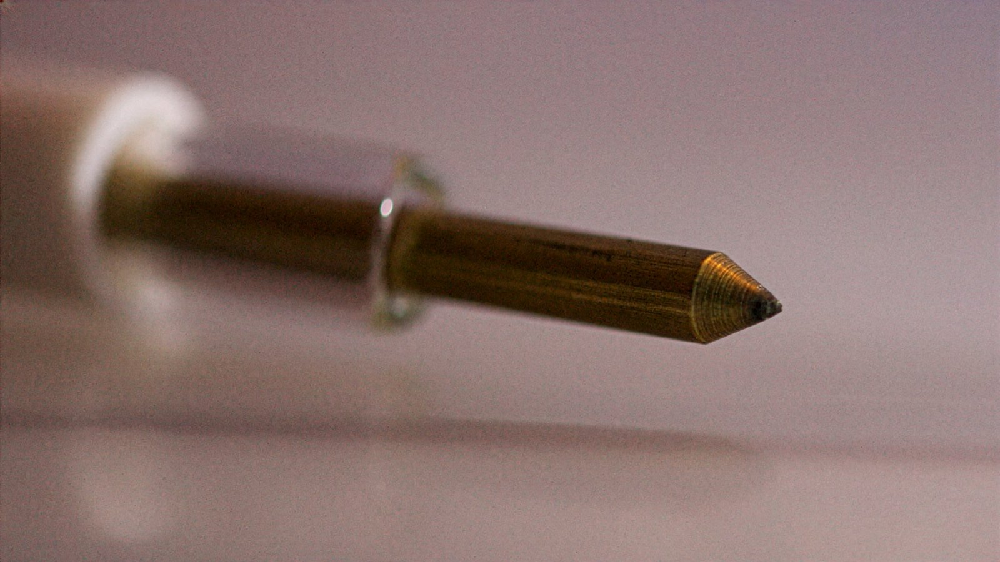
*Eroded electrode tip after extended use. © Lorenz Schwarz, 2017.*
 

Note: some switching power supplies showed signs of degradation over extended use. The cause was never fully identified.

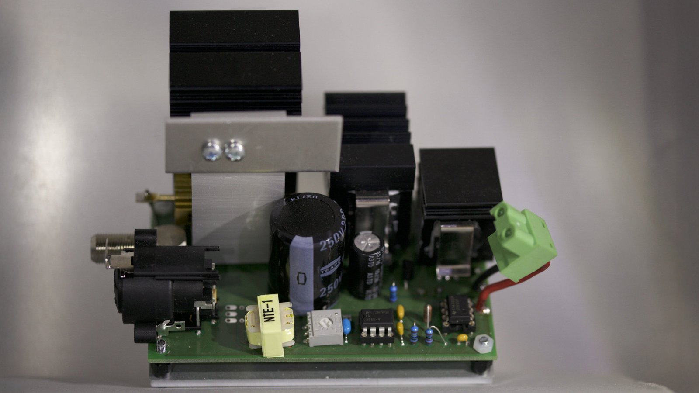
*Driver PCB: XLR input, balanced-to-unbalanced audio transformer, heat sinks. © Lorenz Schwarz, 2017.*
 

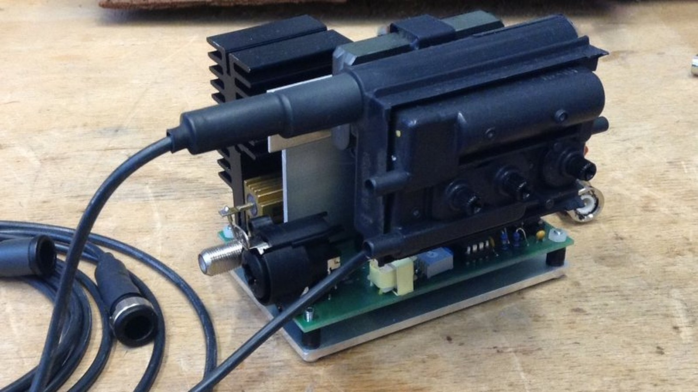
*Plasma driver module with flyback transformer, XLR input, coaxial DC power connector. © Lorenz Schwarz, 2017.*
 

### Safety Considerations

Some circuits described here involve mains-connected power supplies. Mains wiring should be carried out or inspected by a qualified electrician.

Spark discharge produces ozone (O₃) and nitrogen oxides (NOx) as byproducts of arc ionisation. Adequate ventilation with fresh outdoor air rather than recirculated room air, is essential for multi-hour installations. The arc also emits ultraviolet light and may produce low-level soft X-ray emission, however not in significant amounts to cause serious problems under normal operating conditions. The switching circuits produce broadband RF radiation and can cause interference in nearby electronics. This is also potentially dangerous for individuals with pacemakers, who should not be positioned too close to operating units.

### Power Supply

Each driver was powered by a 12V 5A switching power supply and could be
switched remotely via relay. A custom 16-channel relay-controlled power supply
was built for this purpose. The relays were controlled by an Arduino, with
switching triggered from a DAW via MIDI messages to Max/MSP and then converted into serial messages. This allowed speakers to be turned on and off during performance, preventing overheating.

Switching power supplies were chosen primarily for cost reasons, as they are
significantly less expensive than transformer-based alternatives. However,
longer-term experience revealed that transformer-based power supplies produced
better results and were considerably less prone to causing failures in the
plasma speaker driver modules. This is worth noting for future builds.

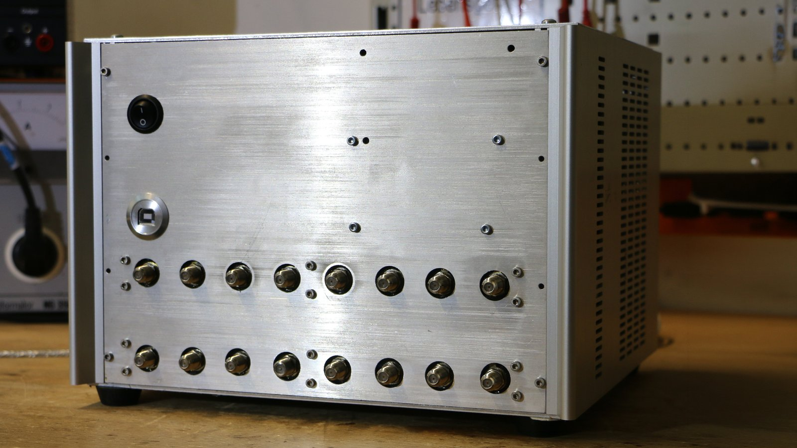
*16-channel relay-controlled power supply. © Lorenz Schwarz, 2017.*
 

---

## Acoustic and Spatial Properties

The plasma arc is, in acoustic terms, a near-ideal real-world point source: a dimensionless origin of sound with omni-directional radiation and no moving parts to introduce mass. This is acoustically significant: each speaker in the constellation radiates independently and isotropically, producing precise localisation cues at all listening positions, allowing listeners to move through the installation and experience the spatial arrangement from multiple positions. In contrast to beamforming systems such as the [IKO](https://iko.sonible.com) (IEM Graz / sonible), which project directional sound from a single device with precise electronic control, the plasma constellation distributes physical point sources across the room, which is a different and less controllable approach, but one that produces genuinely discrete sources rather than synthesised directionality.

The lower cutoff frequency is approximately 1.5 kHz (measured in SPAT, Max/MSP). Percussive and plucked sounds were reproduced with exceptional transparency; voice material remained recognisable despite the absence of the fundamental frequency range, due to the missing fundamental effect. The fluctuating arc is both the source and the image of the sound, a synesthetic condition in which the immateriality of the light contradicts the physical expectation of a vibrating body.

Note: the measurement was conducted in a non-anechoic recording booth. Room reflections contaminate the impulse response, and the short sweep window was a measurement error that limits low-frequency resolution; the dashed portion of the curve below 1 kHz is therefore an estimate. The speakers are currently in storage, so repeating the measurement under better conditions has not been possible. The curve is referenced to 0 dB at 1 kHz and reflects the full signal chain, including the audio circuit and electrodes, not the arc discharge in isolation.

<picture>
  <source media="(prefers-color-scheme: dark)"  srcset="assets/img/plasma-fr-measurement-dark.svg">
  <source media="(prefers-color-scheme: light)" srcset="assets/img/plasma-fr-measurement-light.svg">
  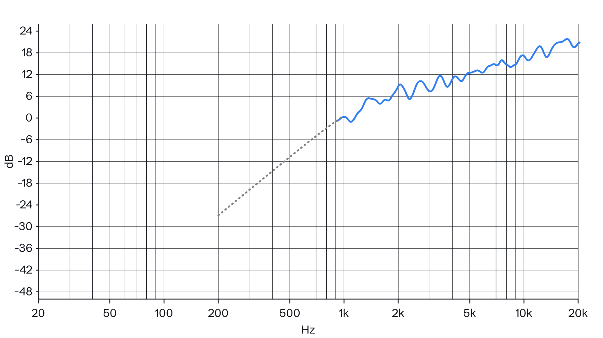
</picture>

*Frequency response measurement with Spat Sweep Measurement Kit, Neumann KM 184, 1m distance, recording booth HfG Karlsruhe. Measured in a non-anechoic environment; dashed line below 1 kHz is an estimate.*
 

---

## Installation and Staging

The flyback coil approach allowed the electrodes to be positioned at a
distance from the driver circuits. Drivers were placed on the floor, with
black silicone high-voltage cables running to the electrode assemblies above.
Electrodes were mounted on laboratory stands, chosen both for their
practicality, minimising acoustic shadowing and maximising point-source directivity, and for the aesthetic reference they make to scientific instrumentation.

<picture>
  <source media="(prefers-color-scheme: dark)"  srcset="assets/img/diagram-dark.svg">
  <source media="(prefers-color-scheme: light)" srcset="assets/img/diagram-light.svg">
  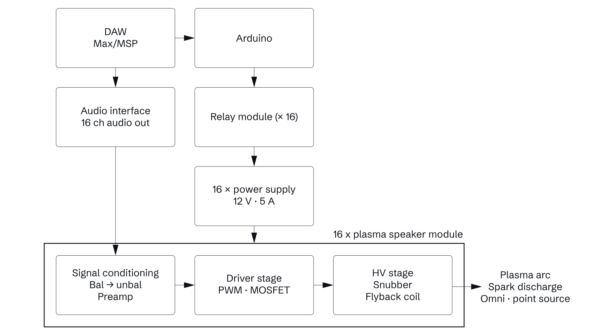
</picture>

*System component diagram: signal chain from DAW through Max/MSP, relay control, and audio interface to 16 plasma speaker modules. © Lorenz Schwarz.*
 

Custom glass-aluminium-steel tables supported the laboratory stands,
reinforcing the minimal lab aesthetic. The speakers were arranged as a
constellation in the centre of the room rather than in a conventional ring or
dome configuration. This sculptural, room-centre arrangement invites audiences
to walk around and through the installation, creating a listening experience
that is spatial and physical rather than fixed.

<picture>
  <source media="(prefers-color-scheme: dark)"  srcset="assets/img/Aufbau_c_Lorenz_Schwarz-dark.svg">
  <source media="(prefers-color-scheme: light)" srcset="assets/img/Aufbau_c_Lorenz_Schwarz-light.svg">
  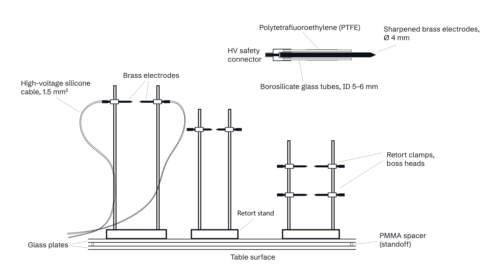
</picture>

*System assembly diagram: electrode, high-voltage cable, driver module, and power supply. © Lorenz Schwarz.*
 

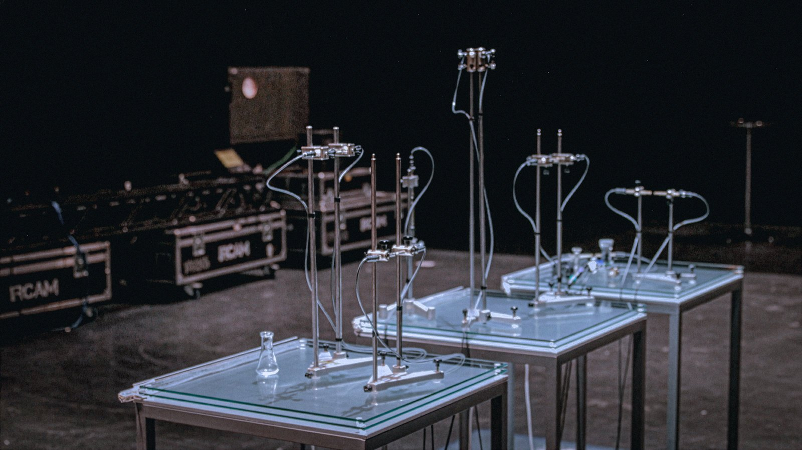
*Early test setup, 2016. Glass tables with laboratory stands and electrode assemblies. © Samuel Israel, 2016.*
 

---

## Sound Concepts

Sound material was produced and processed in Max/MSP and on a Nord Rack 3 virtual analogue synthesizer. Amplitude modulation, ring modulation, and frequency modulation were central to the synthesis process, producing dense, complex textures with an eerie, electrical character. Feedback from the plasma speakers, captured via electret microphones placed within the installation, was recorded and reintroduced as further processed source material. Percussive and transient-rich sounds were used in contrast. Voice recordings were also processed through granular synthesis, fragmented and redistributed across time and the 16-channel space. 

---

## Presentations

The installation was presented internationally at the following venues:

**cel Stage, [KOCCA](https://www.kocca.kr), Seoul, 2016**
With [Bang&Lee](https://www.instagram.com/bangandleestudio/), a Korean media artist duo.

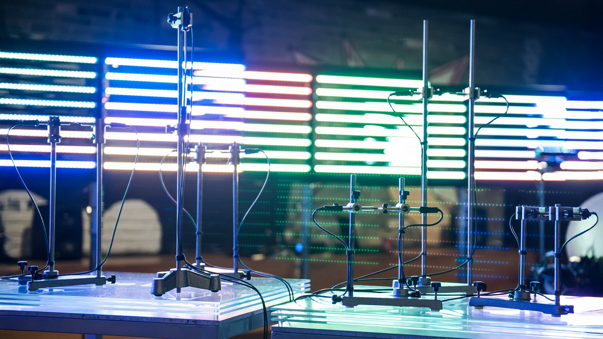
*cel Stage, KOCCA, Seoul, 2016. Multiple speakers visible. © Jayoung Bang, 2016.*
 

**[ZKM | Center for Art and Media Karlsruhe](https://zkm.de), InSonic 2017**
Developed during a grant-supported guest research residency at ZKM. Installation presentation, 12 speakers. Also documented on [Google Arts & Culture](https://artsandculture.google.com/asset/lorenz-schwarz-klanginstallation-f%C3%BCr-12-plasmalautsprecher-lorenz-schwarz/zAHq6W72QGGERg).

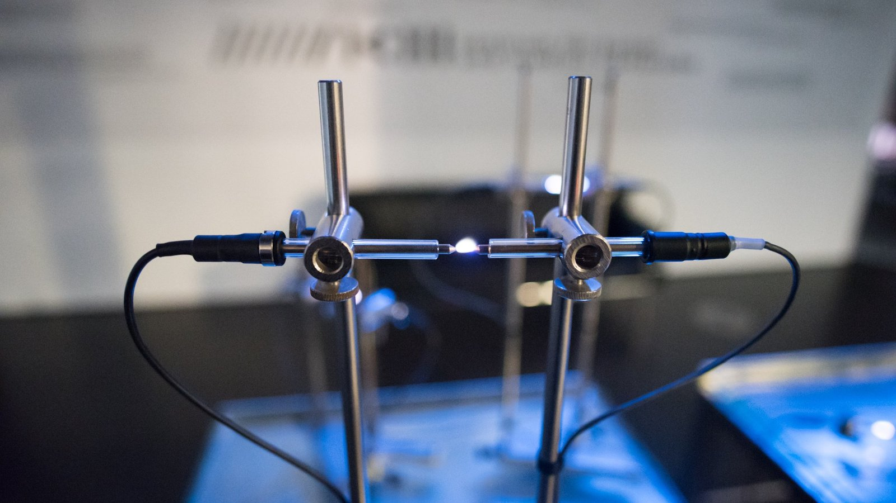
*InSonic 2017, ZKM Karlsruhe. Detail: electrodes on laboratory stand with plasma arc. © MicialMedia / ZKM, 2017.*
 

**klingt gut! Symposium, [HAW Hamburg](https://www.haw-hamburg.de), 2017**
klingt gut! Award.

*klingt gut! Symposium, Hamburg, 2017. Full installation constellation. © Gertje König, 2017.*
 

---

## Links and References

**Documentation**

- [Google Arts & Culture — Klanginstallation für 12 Plasmalautsprecher](https://artsandculture.google.com/asset/lorenz-schwarz-klanginstallation-f%C3%BCr-12-plasmalautsprecher-lorenz-schwarz/zAHq6W72QGGERg)

**Related artistic work**

[Edwin van der Heide's](https://www.evdh.net) *[Evolving Spark Network](https://www.evdh.net/evolving_spark_network/)* (2010) uses spark discharges between multiple electrodes as both sound source and visual medium, exploring the spatial and acoustic properties of electrical arcs as installation material.

**Literature**

- Mollen, M. S., M. S. Mazzola, and G. Marshall. "Modeling of a DC Glow Plasma Loudspeaker." *Journal of the Acoustical Society of America*, vol. 81, no. 6, 1987, pp. 1972–1978.
- Sutton, Y., et al. ["Looking Into a Plasma Loudspeaker."](https://ieeexplore.ieee.org/document/6024475/) *IEEE Transactions on Plasma Science*, vol. 39, no. 11, 2011, pp. 2146–2147.
- Urban, T. [*Theory and Construction of a Plasma Tweeter*](https://download.spsc.tugraz.at/thesis/BA_Urban.pdf). Bachelor's thesis, Graz University of Technology, 2012.
- Wendt, Florian, et al. "Perception of Spatial Sound Phenomena Created by the Icosahedral Loudspeaker." *Computer Music Journal*, vol. 44, no. 1, MIT Press, 2017.

**DIY projects and circuit references**

- [Electronoobs — Flyback Plasma Arc Music Speaker](https://electronoobs.com/eng_circuitos_tut66.php) Two circuit variants with schematics. ([schematic 1](https://electronoobs.com/eng_circuitos_tut66_sch1.php), [schematic 2](https://electronoobs.com/eng_circuitos_tut66_sch2.php))
- [Dr. Scott M. Baker — Plasma Speaker](https://www.smbaker.com/plasma-speaker) With circuit analysis, measurements, and component selection notes.
- [Eastern Voltage Research — Class-E Plasma Speaker Kit](https://www.easternvoltageresearch.com/class-e-plasma-speaker-kit/) Class-E switching topology.
- [plasmaspeaker.de — Ionovac Replica and DIY Ionophone](https://www.plasmaspeaker.de/ionovac-replica.html) Ionovac replica using the original tube-based RF circuit.
- [Instructables — Build a Plasma Speaker](https://www.instructables.com/Build-A-Plasma-Speaker/) Beginner guide to building a flyback-based plasma speaker.
- [Fairchild / ON Semi — AN-4147: Design Guidelines for RCD Snubber of Flyback Converters (PDF)](https://e2e.ti.com/cfs-file/__key/communityserver-discussions-components-files/196/Design-Guidelines-for-RCD-Snubber-of-Flyback-Converters_2D00_Fairchild-AN4147.pdf) Application note on RCD snubber design for flyback converters.
- [CDE — Design of Snubbers for Power Circuits by Rudy Severns (PDF)](https://www.cde.com/resources/technical-papers/design.pdf) Reference covering common snubber topologies and component trade-offs.
- [Bogin, Jr. — NE555 Quasi-Resonant Flyback Driver](https://boginjr.com/electronics/hv/flyback-driver-2/) Quasi-resonant topology tracking the transformer's natural oscillation frequency.
- [Ridley Engineering — Ringing Waveforms in the Flyback Converter](https://ridleyengineering.com/design-center-ridley-engineering/49-circuit-designs/64-converter.html) Analysis of LC ringing in Flyback transformers.

---

## Acknowledgements

This project was developed during a grant-supported guest research residency at [ZKM | Center for Art and Media Karlsruhe](https://zkm.de) in 2017. Thanks to Paul Modler, Holger Förterer, and [Bang&Lee](https://www.instagram.com/bangandleestudio/).

---

## License

© Lorenz Schwarz. Licensed under [CC BY 4.0](https://creativecommons.org/licenses/by/4.0/).
